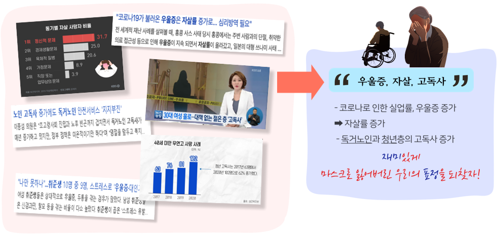
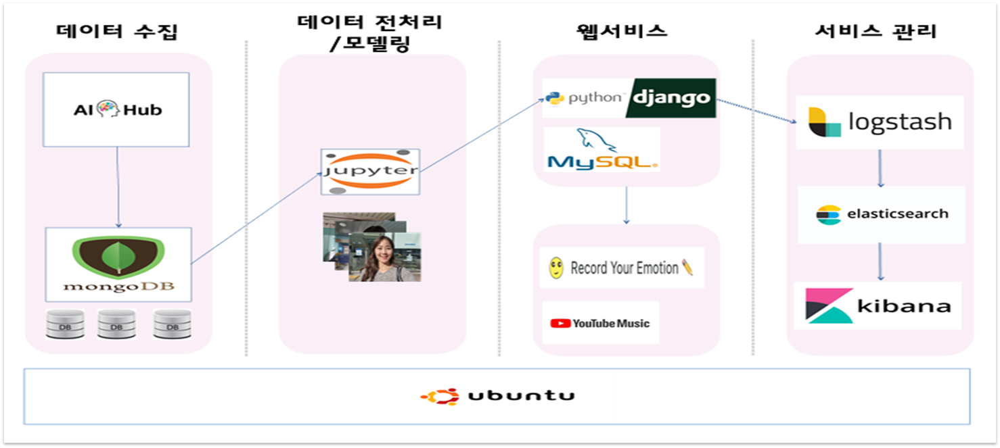
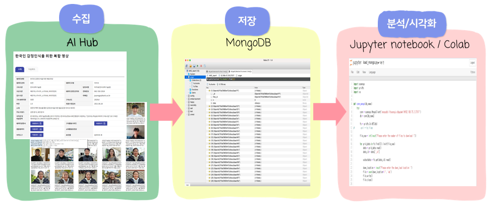
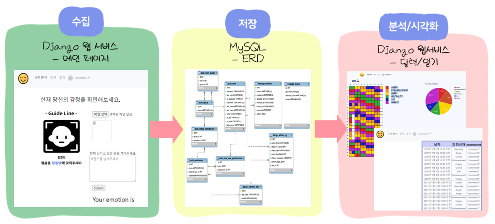
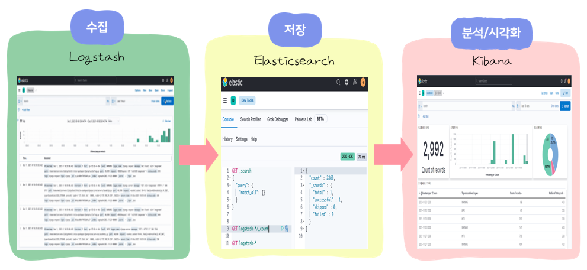
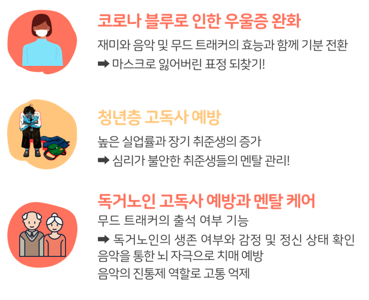

# 3차 프로젝트(삼성멀티캠퍼스)-통합

### K-Digital Training 데이터 사이언스/엔지니어링 과정(7, 8회차)
 
 

# 목차

# 1. 프로젝트 소개

## 🙋‍♀️🙋‍♂️ 프로젝트 팀 소개

조명 : Emotion조

데이터사이언스 : 이소영[조장], 이송현, 임성국

데이터엔지니어링 : 이우림, 유형주, 하은지
 
 

## **💭**기획 배경

- 코로나19가 불러온 주변 사람과 의료 접근성 단절로 인한 우울증  **☛** 자살률 증가
- 독거노인 가정 증가 **☛** 고독사 증가
- 취준생들의 취업 준비 스트레스(신경과민, 탈모 등) 심화 **☛ 우울증, 대인기피증 증가**

 
 

## 🎯 목    표

 
 

## 📚 사용기술

- AWS EC2 (오전8시40분 ~ 오후6시30분 사이만 사용 가능!)
- Linux (Ubuntu)
- Mysql
- Django 3.4.0
- Tensorflow 2.7.0

## 📃 프로젝트 구조

 
 

# 2. 프로세싱

## 1️⃣ 데이터 수집/전처리/모델링

1. AI허브 데이터 확보 후 MongoDB 저장
2. 데이터사이언스팀에서 Jupyter Notebook에 사진을 로드하여 모델링 할 수 있도록 기능 구현

 
 

## 2️⃣ 웹서비스

1. Django 웹서비스 구축
    1. 사용자 사진 업로드 및 코멘트 등록 기능 구축
    2. 감정 분석, 감정 분석 결과에 따른 Youtube 노래 재생
    3. 무드 캘린더에 감정 분석 결과에 매칭되는 색상으로 연간 달력에 기록
    4. 기록된 감정 결과 및 코멘트 조회

 
 

## 3️⃣ 서비스 관리

1. Logstash에 Django 로그를 적재하여 ElasticSearch으로 전송 Kibana에서 로그 시각화
 
 
# 3. 최종 결과물

[https://drive.google.com/file/d/18ais3PvRgGlAOp-XT_rLjIsEAAZeWkrI/view](https://drive.google.com/file/d/18ais3PvRgGlAOp-XT_rLjIsEAAZeWkrI/view)

 
 

# 4. 기대효과

 
 
# 5. 개선사항 및 느낀점

### 1. 감정 분석 결과 수정 기능 추가

- 사용자가 직접 원하는 감정으로 분석결과 수정(감정이 잘못 기록되었을때 수정하기 위함)

### 2. ElasticSearch 대시보드 고도화

- 다양한 로그 데이터 수집을 통한 관리자 대시보드 고도화
- 사용자 성별, 연령대, 감정 분석결과, 다이어리 일기장 내용 수집/분석으로 다양한 통계 데이터 제공 및 그래프 시각화 기능 제공

### 3. 사용자가 업로드한 이미지 주기적 삭제

 
 
# 5. 프로젝트에서 나의 역할

1. Django 웹서비스 구현
    1. 감정 분석 모델을 이용 할 수 있도록 기능 구현(Tensorflow를 이용하여 이미지 분석)
    2. 분석된 감정 결과에 매칭되는 노래 기능 재생 기능 구현
    3. 결과가 데이터 베이스에 저장되도록 기능 구현
